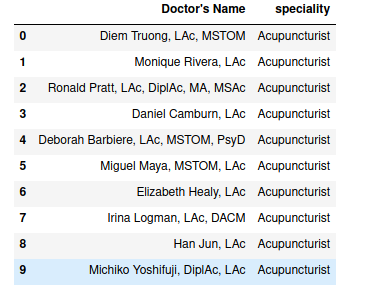

# Zocdoc Web Scraping

# Overview

Scraped **doctor's name** and their **speciality** from https://www.zocdoc.com/specialty website. Initial web page of this website includes many specialities and its corresponding insurances, procedures and reason in which doctors are available. We have to click only specialities and scrape doctor's name and their specific speciality from that webpage. Each speciality have doctor's name in 10 webpages. We have to navigate to each and every pages to scrape the contents. I have used **Firefox browser** so I have used **geckodriver** to link **selenium** and Firefox browser.

# Libraries used

* Beautifulsoup4
* Selenium
* Pabdas

# Total rows and column scraped

Rows = 9298

columns = 2

# Sample dataset scraped

# Python package used

# Framework used

# Tool used

